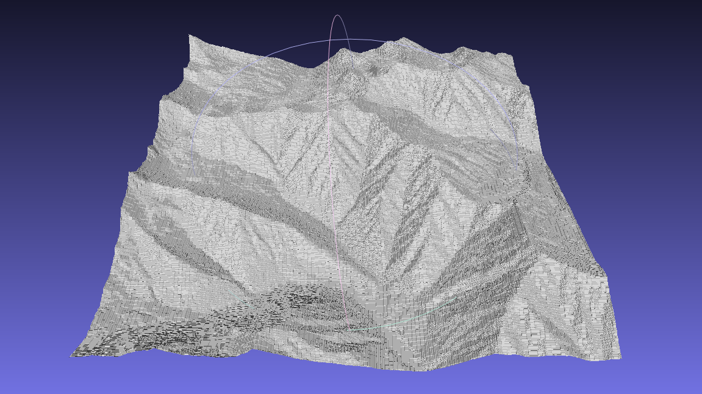

__Building instructions (Linux)__

git clone https://github.com/Nalonoid/hm2obj.git hm2obj

cd hm2obj

mkdir build && cd build

cmake ..

make

The binary will be located in hm2obj/bin

__Usage__

In order to have proper P3 PPM image files:

convert -compress none in.{jpg, png,...} out.ppm

./bin/hm2obj in.ppm out.obj [is_rgb={0,1}]

By default, the images are considered as grayscale.

__Example__

Input image:

Output OBJ in Meshlab:

After a few smoothing steps:

